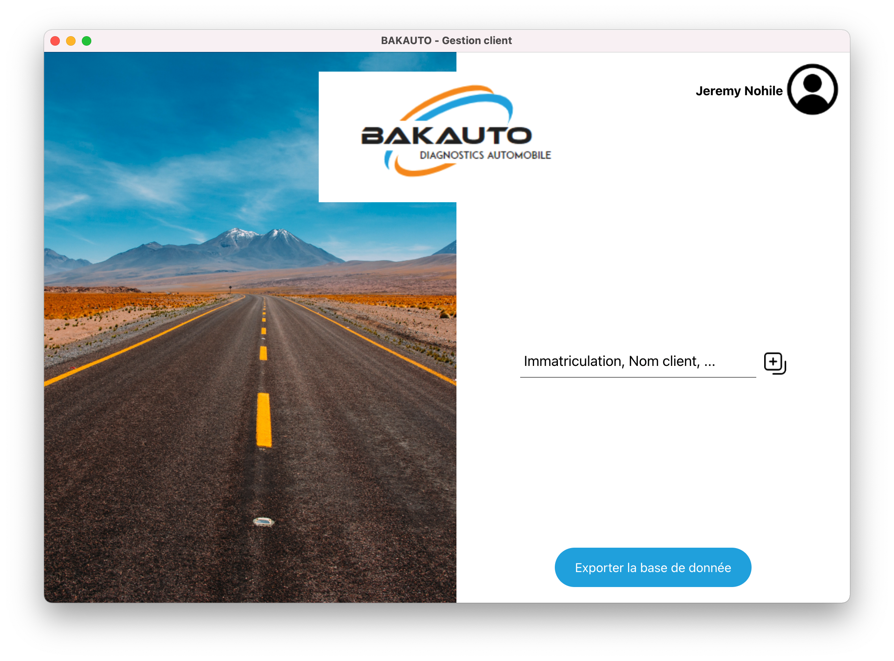
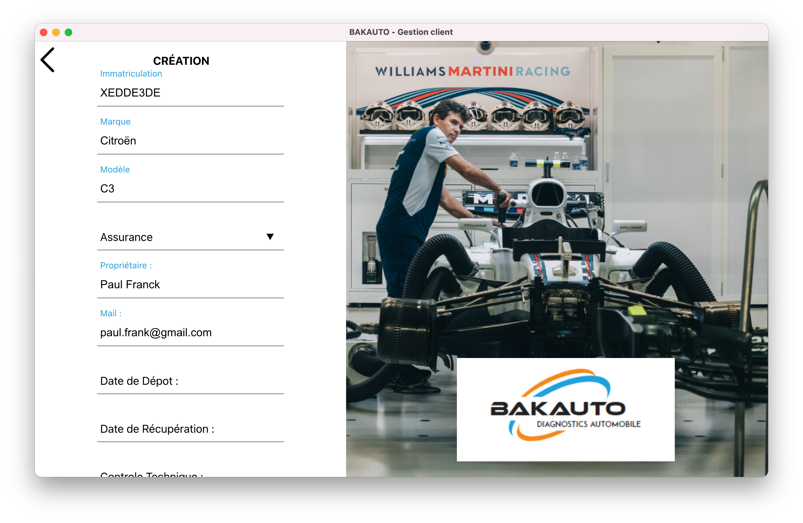

    

<h1 align="center">NJG connect - Application logiciel</h1>

> Application Logiciel Cross-Platform ( Windows - Apple )

 

## Présentation Projet

Ce logiciel a pour but d'améliorer le traitement de leurs documents échangés auprès des divers interlocuteurs,

Au programme: formulaire numérique, création d'un PDF automatique, lecture / intégration d'un pdf éxistant pour extraire les données nécéssaires

## Mise en Situation

BAKAUTO, Société de diagnostics automobile souhaite optimiser le traitement de leurs documents échangés auprès des divers interlocuteurs (Assurance, clients...)

Fonctionnalité de l'application:

- Intégration automatique d'un pdf (comprenant nom du client, prix, modèle de la voiture) généré depuis l'application
- Exportation de données pour l'assurance au format PDF
- Récuperation du montant de prise en charge de l'assurance depuis un PDF
- Afficher le Prix à régler pour le Client

## Capture d'ecran

|              HomePage / Recherche d'un Profil               |               Création / Édition d'un Profil                |                Création d'un PDF Automatique                |
| :---------------------------------------------------------: | :---------------------------------------------------------: | :---------------------------------------------------------: |
|  |  |  |

Pour plus de screenshot / capture d'écran [rdv ici](./src/assets/screenshot/)

## Description

 📄 Formulaire numérique  

> Formulaire simple afin d'enregistrer les infos d'un Client

 😲 Création d'un PDF automatique

> Possibilité de créer un Pdf en fonction des champs renseignés du formulaire

 🙀 Lecture d'un pdf pour extraire les données

> Possibilité d'intégré son Pdf et ainsi récuperer le montant

## Info du Project

Ce projet est créer en Electron / React.Js

### Commande à savoir

<kbd>npm i</kbd> or <kbd> yarn install</kbd> - Install Dependencies

<kbd> yarn start</kbd> - Run the App

En savoir plus sur :

- Electron.js : [For Develop this Project](https://www.electronjs.org/)
- React.js : [For Front Developpment](https://fr.reactjs.org/)

ENJOY 🙂

## Team

- Designé par [Jonathan Nohile](https://www.linkedin.com/in/jonathan-nohile)
- Développé par [Jeremy Noh](https://github.com/JeremyNoh)

 

Merci à vous 🤗
